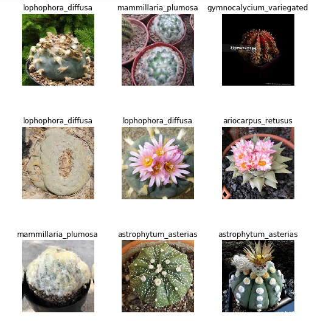
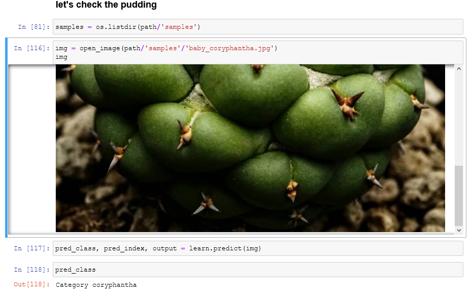

# cactus-identifier

In this mini-project, we build a simple image classifier for cactii (cactuses?). Why cactus? I was going through a phase with growing cactus - this miniproject is collateral damage :) .
The repo consists of 1 single notebook laying out the pipeline (Cactus Pipeline.ipynb) and several folders of images as data.

# Data
The images used for training are scraped from bing/google image search using the cactus types as keywords. There are 6 types in total stored in 6 corresponding folders, all shown in the samples below:

In Data/samplesthere are some new images, taken from places other than bing/google searches like facebook, instagram or my own cactus. These were used as unseen photos for testing, like below. Accuracy seems great.

# The pipeline
The pipeline contains the steps to scrape the images via , taken from the fastai lessons with some modifications from the forums (as the old code doesn't quite work).
The model is written in Python using fastai and built using transfer learning on a pretrained Resnet. There's not much fancy technique-wise, the model being beginner-level and all; it does show the power of transfer learning and time-proven techniques however.

# Possible expansion
I suppose one direction is to export this to be used more widely, like an app or api. Would probably require expanding the set of data labels though.
